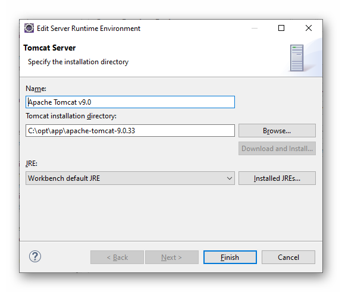
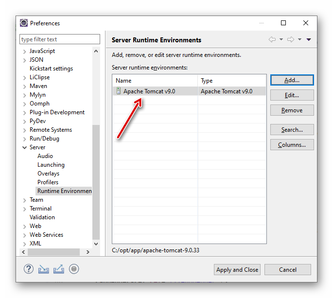
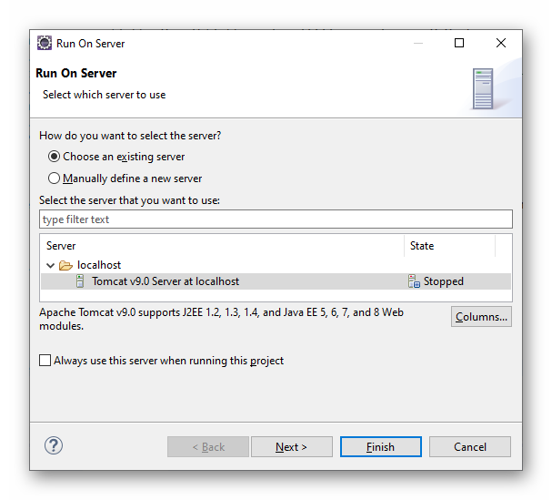
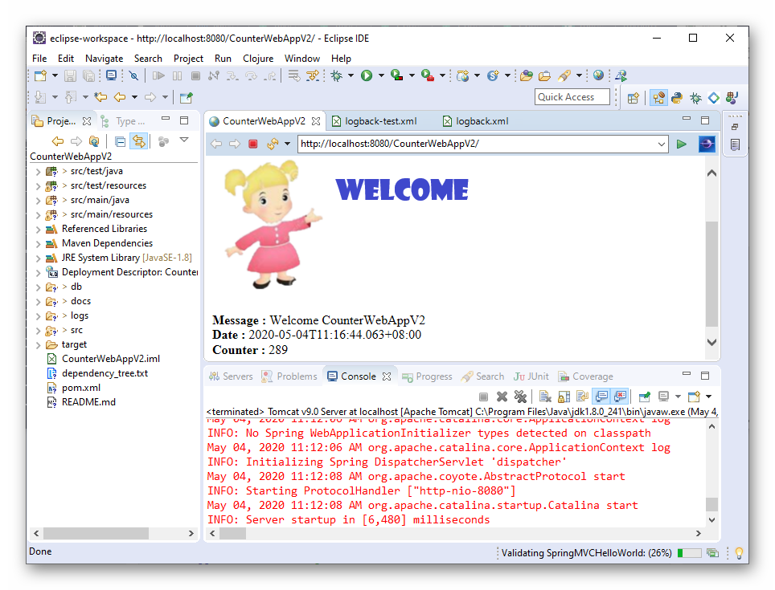
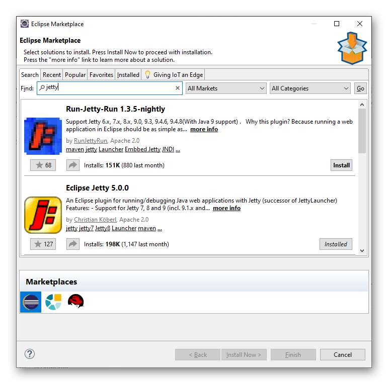
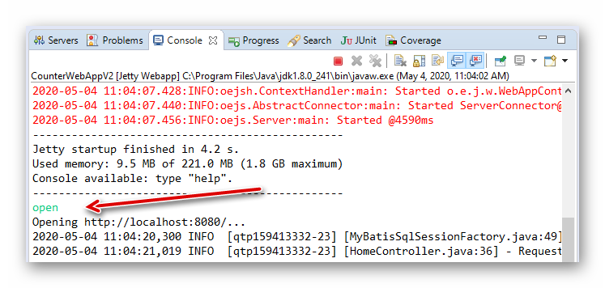
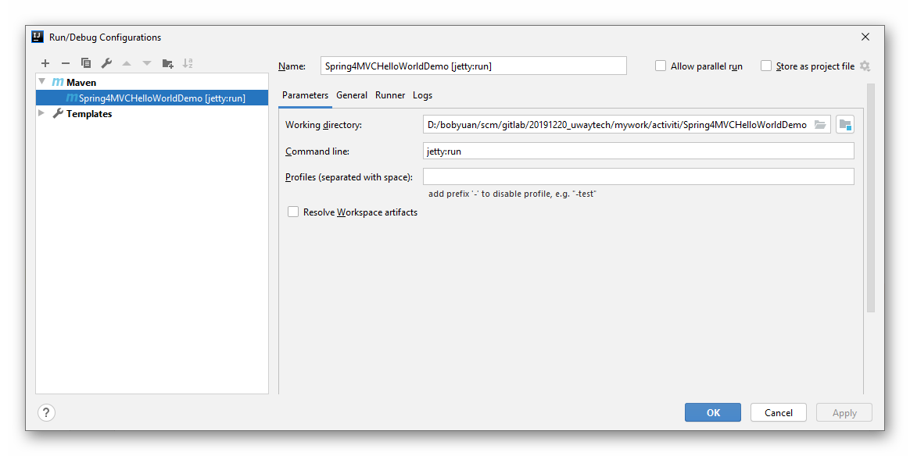

# Counter Web Application V2 - Developer Notes

This is an example Java Web Application for web counter.

It shows the following:

  - Maven project configuration (pom.xml), using Spring MVC as web application framework.
  - Maven build and static website generation with reports.
  - Logging with SLF4J API, and use logback as the implementation.
  - Database (SQLite, MySQL) integration with MyBatis.
  - Unit testing and coverage.


**Reference Links:**

  - [How to create a Web Application Project with Maven](https://www.mkyong.com/maven/how-to-create-a-web-application-project-with-maven/)
  - [logback.xml Example](https://mkyong.com/logging/logback-xml-example/)
  - [Solving Your Logging Problems with Logback](https://stackify.com/logging-logback/)
  - [slf4j: how to log formatted message, object array, exception](https://stackoverflow.com/questions/6371638/slf4j-how-to-log-formatted-message-object-array-exception)
  - [MyBatis 3 Annotation Example with @Select, @Insert, @Update and @Delete](https://www.concretepage.com/mybatis-3/mybatis-3-annotation-example-with-select-insert-update-and-delete)
  - [MyBatis with Spring](https://www.baeldung.com/spring-mybatis)


## Developer Notes

The development environment:

  - OS: Windows 10 Pro 64-bit.
  - JDK: Oracle JDK 1.8.0
  - Maven: Apache Maven 3.6.3
  - IDE: Eclipse IDE for Enterprise Java Developers, or IntelliJ IDEA.


Maven build commands:

1. Create the web application.
   
   ```shell
   # Create the "CounterWebAppV2" web application.
   mvn archetype:generate -DgroupId=com.example -DartifactId=CounterWebAppV2 -DarchetypeArtifactId=maven-archetype-webapp -DinteractiveMode=false
   
   # Navigate to "CounterWebAppV2" folder.
   cd CounterWebAppV2
   
   # Generate Eclipse web project files.
   mvn eclipse:eclipse -Dwtpversion=2.0
   ```
   
2. Build the web application.
   
   ```shell
   # Check jar dependency, useful in finding the conflicting jars.
   mvn dependency:tree
   
   # Run jetty server at http://localhost:8080/.
   mvn jetty:run
   
   # Clean up target folder (delete all).
   mvn clean install
   
   # Build (include testing) and install to local repository.
   mvn install
   
   # Build the release ".war" package.
   # To skip unit testing, add parameter: -Dmaven.test.skip=true
   mvn clean package 
   
   # Generate static site and reports.
   mvn site
   ```


## IDE Setup


### Eclipse with Tomcat

Open menu "Window | Preferences" to show Preferences dialog. In "Server | Runtime Environment", add Tomcat.



When complete, it should look like this:



Select the project (here it is "CounterWebAppV2") in the "Project Explorer", then select menu "Run | Run As | Run On Server". 

> Note: For debug, select menu "Run | Debug As | Debug On Server". In debug mode, we can set breakpoint in Java code.



Click "Next", and then " Finish" button to start the Web Application. 

Normally it will automatically open a browser to access the web application.




### Eclipse with Jetty

A plugin is been used. Open "Eclipse Marketplace" and search for "jetty", install the "Eclipse Jetty" plugin.



Select the project (here it is "CounterWebAppV2") in the "Project Explorer", then select menu "Run | Run As | Run with Jetty". 

> Note: For debug, select menu "Run | Debug As | Run with Jetty". In debug mode, we can set break point in Java code.

 

Click "Run" button to launch Jetty server. We can see log output in Console. When Jetty started, we can type command "open" in Console to open the browser to the web application.



We can enter "stop" to stop the server gracefully.

There are more commands available, you can enter "help" for more information.

```
help
help, h, ? <arg>    Shows a list of commands and provides help for each command.
memory, m <arg>     Memory utilities.
thread, t <arg>     Thread information.
prop, p <arg>       Manage system properties.
echo, e <arg>       Prints the text.
mbean, mb <arg>     Access local MBeans.
open, o             Opens a browser.
dump, d             Dump the state of Jetty.
info, i             Show the launcher info.
restart, r          Restarts the server.
stop, s             Stops the server gracefully.
exit, x             Exits the VM.

Using > will pipe the output of any command to a file. Arguments may contain 
${..} placeholds, to access environment and system properties.
```


> Note: Sometimes I noticed problem running this web application by this plugin, then I run `mvn clean jetty:run` to rebuild the project, it will become OK.


### IntelliJ IDEA with Jetty

IntelliJ brings Jetty support, but only in Ultimate Edition.

A workaround is to use Maven plugin. I have this plugin configured in `pom.xml` as below:

```xml
<build>
    <plugins>
        
       <!-- Jetty Maven Plugin 
       The Jetty Maven plugin is useful for rapid development and testing. 
       Usage: mvn jetty:run 
       https://mvnrepository.com/artifact/org.eclipse.jetty/jetty-maven-plugin 
       -->
        <plugin>
            <groupId>org.eclipse.jetty</groupId>
            <artifactId>jetty-maven-plugin</artifactId>
            <version>9.4.28.v20200408</version>
            <configuration>
                <httpConnector>
                    <port>8080</port>
                </httpConnector>
                <scanIntervalSeconds>10</scanIntervalSeconds>
                <webApp>
                    <contextPath>/</contextPath>
                    <descriptor>src/main/webapp/WEB-INF/web.xml</descriptor>
                </webApp>
                <systemProperties>
                    <systemProperty>
                        <name>workerId</name>
                        <value>0</value>
                    </systemProperty>
                </systemProperties>
            </configuration>
        </plugin>
        
    </plugins>
</build>
```


Then I can run or debug in IntelliJ IDEA by this configuration:



I can set break-point in Java code for debugging. However, as I did not use it intensively, so I am not sure if it is OK for serious development.


## Database Setup

This example can use SQLite, and MySQL as back-end database.

The database connection is configured in `mybatis-config.xml` under the resource folder `src/main/resources`. 


### SQLite

This is a file based database, the data file is `db/sqlite/counter.db`. You have to give the correct path in `mybatis-config.xml` pointing to the data file.

> Note: 
>
> * Sometimes the relative path will cause problem! In such case, you can change to the absolute path.
> * A free tool called [DB Browser for SQLite](http://sqlitebrowser.org/) is recommended to work with SQLite database development.


It has only 1 table, defined as below:

```sql
CREATE TABLE `TabCounter` (
	`CounterId`	INTEGER NOT NULL PRIMARY KEY AUTOINCREMENT,
	`CounterName`	TEXT NOT NULL UNIQUE,
	`CounterValue`	INTEGER DEFAULT 0
)
```

No need to initialize the table with data.


### MySQL

This web application can use MySQL (version 5.7) as backend database. In my development environment, I have a local MySQL database running as Windows service.

> Note: 
>
> * A free tool called [HeidiSQL](https://www.heidisql.com) is recommended to work with MySQL database development. It is also available in Windows Store.


Connect to MySQL database and check its version.

```shell
# Connect to MySQL in localhost as root.
mysql -h localhost -u root -p
```

Once connected, check the environment.

```mysql
# Show version (it shows 5.7.26 on my PC).
select VERSION();
```

Souce in DB schema and data. This will create a database `counterdb`, grant permission (user: counterdbuser / CounterDbPasswd1+), and create table `TabCounter`.

```mysql
# Source in the schema.
source mysql_counterdb_schema.sql

# Souce in the table and data.
use counterdb;
source mysql_counterdb_data.sql;

# Check the tables.
show tables;

quit;
```


## Deployment

The following steps are for Windows, but they should apply the same to Linux.

Before deployment, we should have generated the release package `CounterWebAppV2.war` in target folder:

```shell
mvn clean package -Dmaven.test.skip=true
```


### Deploy to Jetty

Assume JDK 1.8 is available.

1. [Download](https://www.eclipse.org/jetty/download.html) the latest version of Jetty, extract to somewhere. Here in my example, it is `C:\opt\app\jetty-distribution-9.4.28.v20200408`.
2. Copy the release file`CounterWebAppV2.war` to `webapps` folder in Jetty.
4. Copy `db` folder from source code into Jetty, if it is not exist there.

The folder structure will be like this:

```
C:\opt\app\jetty-distribution-9.4.28.v20200408
├─db
│  ├─mysql
│  │      mysql_counterdb_data.sql
│  │      mysql_counterdb_schema.sql
│  │      
│  └─sqlite
│          counter.db
│
└─webapps
        CounterWebAppV2.war

```


Now goes to Jetty home directory (this becomes the **current working directory**), launch it by command: 
```shell
java -jar start.jar
```

Open a browser, enter this URL to access the web application: http://localhost:8080/CounterWebAppV2

If anything goes wrong, check the web application log in `logs` folder.


To stop Jetty, just press "Ctrl+C" to terminate the jetty process.


### Deploy to Tomcat

Assume JDK 1.8 is available.

1. [Download](https://tomcat.apache.org/download-90.cgi) the latest 9.x version of Tomcat, extract to somewhere. Here in my example, it is `C:\opt\app\apache-tomcat-9.0.33`.
2. Copy the release file`CounterWebAppV2.war` to `webapps` folder in Tomcat.
4. Copy `db` folder from source code into Tomcat, if it is not exist there.

The folder structure will be like this:

```
C:\opt\app\apache-tomcat-9.0.33
├─db
│  ├─mysql
│  │      mysql_counterdb_data.sql
│  │      mysql_counterdb_schema.sql
│  │      
│  └─sqlite
│          counter.db
│      
└─webapps
      CounterWebAppV2.war
```


Now goes to Tomcat home directory (this becomes the **current working directory**), launch it by command: 
```shell
bin\startup.bat
```

Open a browser, enter this URL to access the web application: http://localhost:8080/CounterWebAppV2

If anything goes wrong, check the web application log in `logs` folder.


To stop Tomcat, run command:

```shell
bin\shutdown.bat
```


